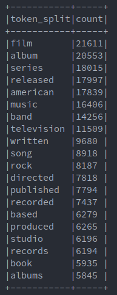

# Big Data Analytics Project - Analyzing Wikipedia with Apache Spark

This project is developed as part of the course _Big Data Analytics_ of the
Master of Science in Engineering, Hes-SO Master.

The objective is to analyze Wikipedia in order to automatically give a topic
name for each article, by selecting more or less 5 words which describe best the
article.

It is a bit of an exploratory project, where multiple algorithms will be tried
and compared.

## Dataset description

The datasets which are used for the analysis are available here:

[Wikipedia dumps](https://dumps.wikimedia.org/enwiki/latest/)

There are actually multiple files from the link below which are used, depending
on which algorithm is used:

- The abstract dumps, which contains only the titles and abstract of the articles
- The page dump, which contains the whole articles (titles, links, categories, etc...)

Note that there is no need to download it by yourself. The whole download and
preprocessing can be done by launching the following command from the root
folder:

```bash
cd preprocessing
./preprocess.sh
```

### Size of the dataset

| dataset  | size                     |
|----------|--------------------------|
| abstract | 5.4GB (extracted archive)|
| page-1   | 617MB (extracted archive)|
| page     | 15Go (compressed archive)|

Because the complete page dump has a size of 15Go when its compressed, a subset
has been used (page-1) for the tests in order to have a faster execution time.


### Content of the dataset

Each dump contains a very messy XML document, with various information ranging
from the title of a document to the author of the last modification. There are
also a lot of specials characters in the whole document or strange annotations.

The data which are kept are the following:

- Abstract dump
    - Title
    - Abstract
- Page dump
    - Title
    - Categories

The abstract are used for unsupervised clustering, while the categories are
intended to be used with supervised classification.


## Features descriptions/extraction and preprocessing

The raw dataset as presented in the previous chapter has two problems:

1. It is an XML document, and Spark is not known for its XML parsing skills
2. It contains a lot of unnecessary information, as well as specials characters
   which are of no use for the purpose of this project.

To solve theses problems, a preprocessing step in Python needs to be done. The
resulting files are two JSON documents, one for the abstract named `abstract.json` 
and another for the categories named `categories.json`.

Let's see what they look like:

```json
// abstract.json
{
  "title": "title of the article",
  "text": "abstract of the article"
}

// categories.json
{
  "title": "title of the article",
  "categories": ["a random category", "another one", ... ]
}
```

These two documents can now be trivially read into a Spark `DataFrame`. Of
course, this first step has for only goal to give the dataset to Spark in a
friendly way. Therefore, more preprocessing needs to be done from Spark.

### Preprocess the DataFrame with Spark ML

Let's start with the abstract dataset which is used for the unsupervised
algorithms. Two transformations are applied to the raw dataset before
starting its analysis. Each one is described below.

1. The text of each abstract is just a big `String`, which is not ideal for working
   with words. This problem can easily be solved by applying a _Tokenizer_ to each
   cell of the text column. This will split the String, leaving us an array of words
   to work with.
2. It's very usual to remove stop words from a corpus. Without surprises, this
   preprocessing undergo the same process.

It is then necessary to extract features from these clean abstract, to
represent them in a way where computations can be applied to them.

Two different features extraction algorithms are used:

1. `CountVectorizer`: Extract a vocabulary from the abstracts, which can then
   be used by LDA.
2. `Word2Vec`: Trains a model which map a string to a vector, where similar
   words are close in the vector space. These features can be used with KMeans
   clustering.

For the categories dataset, there are actually not a lot of preprocessing,
since they can be extracted in a really simple way.

## Analysis questions

The questions that this project is trying to answer can be formulated like this:

- How well can we regroup Wikipedia articles according to their similarity ?
- Can we extract the most informative words from these groups in order to give them a label ?

In other words, the idea is to apply topic modeling to the Wikipedia corpus,
thanks to various techniques and evaluate them. At the end, a small number of
topic must be extracted, with a high level of abstraction. It means that the
topic must define broad subjects like politics, geography, art, etc... While it
should not find specific topics like e.g. Geopolitics of Europe.

## Algorithms

This chapter is split into to categories, one for the unsupervised algorithms
and one for the supervised algorithm.

### Unsupervised algorithms

Three attempts have been made, where each one is a bit better than the previous
one. Let's describe them one by one.

#### LDA

The first idea was to use `LDA` to cluster the vocabulary extracted thanks to
`CountVectorizer`. Once the documents are regrouped, it is possible to
retrieved the words assigned to each cluster, which is intended to be used as the
description of the topic.

With a bit of imagination, the results seem to have a certain logic. However,
it is not as obvious as it should and some clusters are a bit messy.


#### Word2Vec and KMeans

The second idea was to use `KMeans` to cluster the vectors extracted thanks
to `Word2Vec`. Once the documents are regrouped, their label is assigned as
follow:

- Get the vector representing the center of the cluster
- Find the N closest vectors and retrieve the words they are mapping

The results are a bit improved compared to the `LDA` algorithm, but it is not
the holy grail either.


#### KMeans and words occurrences

Finally, a third method has been tried. The idea is pretty easy and can be
described as follow:

- Apply `KMeans` to the `Word2Vec` vectors
- For each cluster, retrieve all the words belonging to it
- Count the number of occurrences of each unique word of the cluster
- Extract the N words with the highest occurrences and use them as a label

The results are far more comprehensible and the subject of a topic can be
discovered in a second.

### Supervised algorithm

The supervised algorithm was intended to be used with the categories dataset.
However, once they had been loaded into a `DataFrame`, it reveals some problem
with the data:

There are far too much categories, some being very specific and containing only
2-3 articles. Furthermore, each article has multiple categories assigned to
it. It results that these categories are absolutely not usable as
labels for unsupervised learning.

No further processing have been done with this dataset, therefore no specific
supervised algorithm has been chosen.

## Optimizations

At the beginning, the page dataset containing the whole corpus was used for the
unsupervised clustering, but the results were really bad independently from
the algorithm.

After analyzing the dataset, it occurred that each Wikipedia article contains a LOT of
details. Let's take a city article for the sake of the example:

The following categories can be found in its sub-chapters:

- Geography
- Politics
- History
- Education
- Economy
- etc..

It results that a complete article contains far more information than we need, degrading the
performance of the clustering. On the other hand, the abstract of each article
is very concise and give a better insight about it.

## Tests and evaluations

Since the algorithms which are used are unsupervised, there are no performance
metrics which can be used for the tests. However, one point which can be
measured is the time needed for each algorithm to produce a result.

Therefore, the evaluation has been done around two aspects:

- the time needed for the algorithm to train
- an empirical evaluation of how  easily the topic of a group of words can be
  guessed

Surprisingly, the algorithm with the better empirical results is also the one
with the best train time. Their ranking is the following:

1. KMeans + occurrences
2. KMeans + Word2Vec
3. LDA + CountVectorizer

In terms of clustering, `KMeans` is really faster than `LDA`. On the other
hand, the choice of the feature extractor does not have a big impact on the
computation time.

There is something else which has an influence on the compute time: the number
of transformations which needs to be applied to the `DataFrame`. For example,
counting the number of occurrences of each word inside a cluster can be
trivially done, while assigning each word vector to its closer cluster and then
find the closest vector to the center needs more transformations.


## Results

Let's go back to the analysis question: _"How well can we produce high-level
topics, regrouping similar Wikipedia articles ?"_ 

Well, let's have a look at one of the clusters produced by KMeans +
occurrences: 




There are three interesting things to discuss:

First, we can see that the cluster is regrouping some artistic production like
movies, cinema, music, band, writing etc... This is indeed a "high-level" topic which
could be named for example "art".

On the other hand, we can notice that multiple specific words are given, and
the "high-level" topic must be discovered by the reader.

Finally, the number of cluster has an influence on the results. For example, if
too few clusters are specified, some clusters will look like a mix between
multiple topics. On the contrary, when too many clusters are specified, some
clusters will split into different ones (e.g. the picture shown above could be
split into _cinema_ and _music_), and completely new clusters, will be created.

To conclude these results, we can say that yes, it is possible to regroup
similar articles, and the result seems pretty neat, but it is harder to assign
them a "high-level" topic with only a few words.

## Future work

While the categories cannot be used as label for an unsupervised algorithm, no
further investigation about a labellized dataset have been made. Because a
supervised algorithm can be evaluated more easily, developing a classification
algorithm would be the next logical step of this project.

In parallel, improving the unsupervised topics labeling by narrowing down to 2
or 3 words the results would be another interesting task to solve.

## Cloud cluster

To run this program in the cloud, follow this steps. Be aware that specified versions of libraries, spark and scala are important. Other versions have not been tested.

### Requirements

You need the following tools installed on your local machine.

- awscli (`pip install --user awscli`)
- Flintrock (`pip install --user flintrock`)

This tools need your AWS access key to work. So create a file at `~/.aws/credentials` and put the following inside:

```sh
[default]
aws_access_key_id=your_aws_access_key
aws_secret_access_key=associated_secret_access_key
```

### Upload dataset on S3

Use aws-cli to upload the dataset (wiki.json) into a S3 bucket.

```bash
aws s3 mb s3://bda-wiki-bucket
aws s3 cp /path/to/wiki.json s3://bda-wiki-bucket
```

### Configure Flintrock

Copy `flintrock-config-example.yaml` to `flintrock-config.yaml` and update fields corresponding to your account.

```yml
services:
  spark:
    version: 2.4.3
    download-source: "https://archive.apache.org/dist/spark/spark-{v}/spark-{v}-bin-hadoop2.7.tgz"

provider: ec2

providers:
  ec2:
    key-name: aws-bda-project # key pair name in aws
    identity-file: "/path/to/private_key.pem"
    instance-type: m3.medium # Choose EC2 flavor
    region: us-east-1
    ami: ami-0b8d0d6ac70e5750c # Amazon Linux 2, us-east-1
    user: ec2-user
    vpc-id: vpc-dc7caea6 # your VPC id
    subnet-id: subnet-42fe2b7c # one of your subnet id
    security-groups:
      - only-ssh-from-anywhere # security-group name that allow ssh (22) from anywhere (0.0.0.0/0)
    instance-profile-name: Spark_S3 # IAM Role with AmazonS3FullAccess policy
    tenancy: default
    ebs-optimized: no
    instance-initiated-shutdown-behavior: terminate

launch:
  num-slaves: 1 # Choose number of slaves

debug: false
```

This config file will be read by the script `create-cluster.sh`.

### Launch and configure the cluster

Launch your cluster using the script `create-cluster.sh`

```bash
./create-cluster.sh bda-wiki-cluster
```

This script will create and configure the cluster. Then it will download some required jars directly in the cluster instances.
This jars are required to access your dataset stored on S3 from Spark.

### Package the program

First, you need to package the program in a jar file that you will upload on the cluster. You can use sbt in command line or compile your project from your IDE.

```bash
cd /path/to/WikipediaTopicLabeling
sbt package
```

This will generate a jar file in `./target/scala-2.11/wikipedia-topic-project_2.11-1.0.jar`

### Submit a job to the cluster

To submit a job, you need to know the DNS name of the master node of your cluster. It has been shown by the `create-cluster.sh` script. But you can also get it with:

```bash
$ flintrock describe
Found 1 cluster in region us-east-1.
---
bda-wiki-cluster:
  state: running
  node-count: 2
  master: ec2-100-25-152-130.compute-1.amazonaws.com
  slaves:
    - ec2-54-152-129-154.compute-1.amazonaws.com
```

Here it is `ec2-100-25-152-130.compute-1.amazonaws.com`

Then you can use the script `launch-app.sh` to upload the packaged app and submit a new job. It requires 2 arguments which are the cluster name and the master DNS name.

:warning: Spark bin folder needs to be in your PATH. You can update your PATH variable by adding `export PATH=$PATH:/path/to/spark-2.4.3-bin-hadoop2.7/bin` in `.env` file, which will be sourced automatically by running the following script.

```bash
$ ./launch-app.sh bda-wiki-cluster ec2-100-25-152-130.compute-1.amazonaws.com
[...]
Go to http://ec2-100-25-152-130.compute-1.amazonaws.com:8080 to view the app running.
```

As the script say, you can then follow your app execution via spark web interface at the given address.
